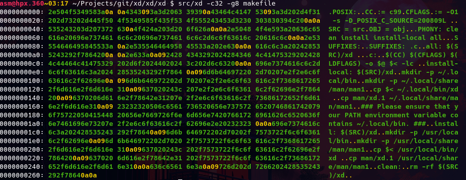
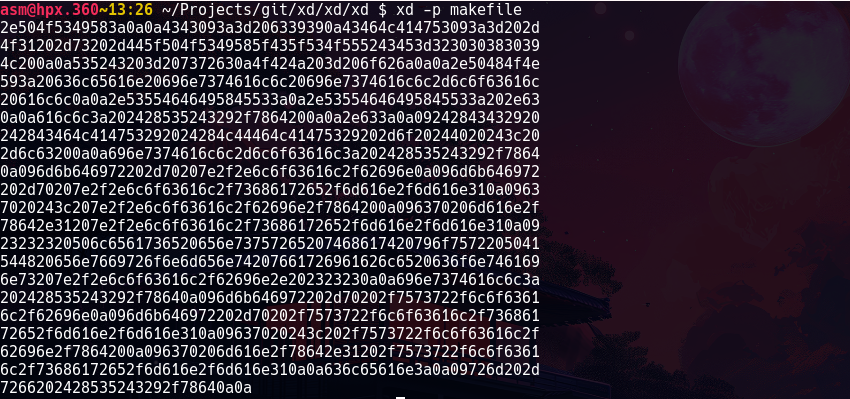
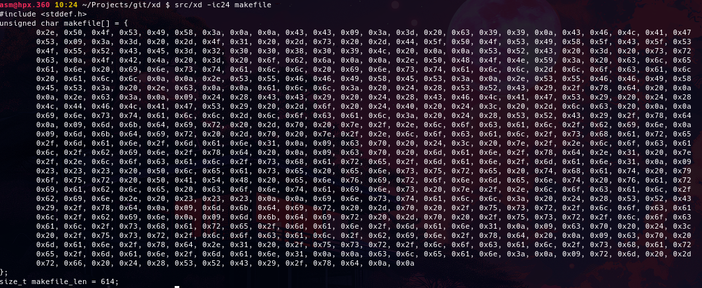
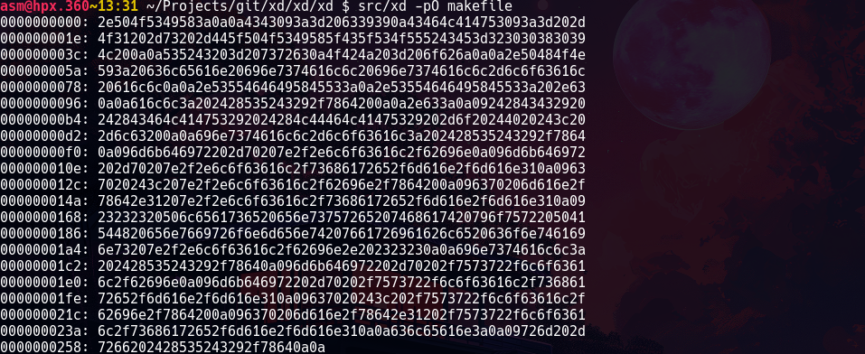

# xd - Hexdump Utility
## Description

xd is a command-line utility that displays a hexdump table of specified files or standard input. It provides detailed information about the contents of a file in hexadecimal format, making it useful for analyzing binary data.

## Installation
### Local
1. Run:
```
make install-local
``` 
### Global
1. Ensure that your a root user with `id` or `who am i`. If not, use `su`.
2. Run:
```
make install
```

## Examples





## Author
xd is created and maintained by Arthur de Souza Manske. For any inquiries or feedback, contact [usr.asm@pm.me](mailto:usr.asm@pm.me).
Licensied under this [terms](LICENSE) 

## Contributing
Contributions to xd utility are welcome. But don't suggest bloated things; Such as functionalities that can be replied by other tools, like applying after a certain offset of the file. 
